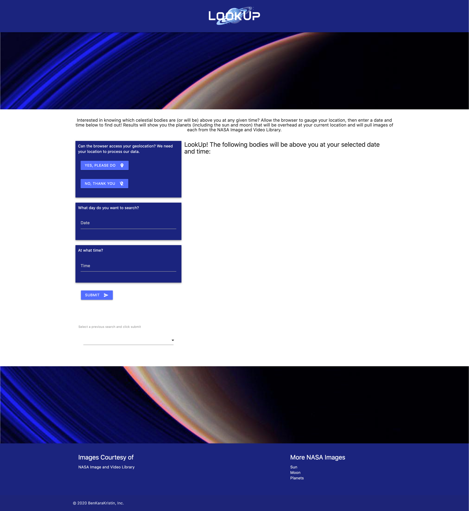

# LookUp
LookUp is an astronomy-based app that allows the user to use their browser location at a chosen date and time to see a list of planetary objects that will be above them. Each search result includes a corresponding photo of the body from NASA Images.

## User Story
AS A novice astronomer 
I WANT to see which bodies (planets, moon or sun) are overhead at any given date or time at my location 
SO THAT I can be more knowledgeable about what’s there so I can better find them! 

GIVEN I am using this app to see available celestial bodies overhead 
WHEN I ask the app for my location 
THEN I am asked for permission to access my browser’s location 
WHEN I enter in the date and time 
THEN I am presented with a list of celestial bodies along with their pictures 
WHEN I want to look at previous searches 
THEN I can find a list of the most recent searches that will auto-populate the search fields. 
WHEN I refresh the page 
THEN I want to be able to see past searches 

## Deployment
LookUp is published at https://benmcrae5.github.io/lookup-by-ben-kara-kristin

## Technologies Used
- HTML/CSS
- JavaScript
- jQuery
- Materialize CSS
- Google Fonts
- Moment.js

## APIs Used
- NASA Image and Video Library API (https://images-api.nasa.gov)
- AstronomyAPI (https://api.astronomyapi.com)

## Authors
- Benjamin McRae  
- Kara Krzystan  
- Kristin Moon
